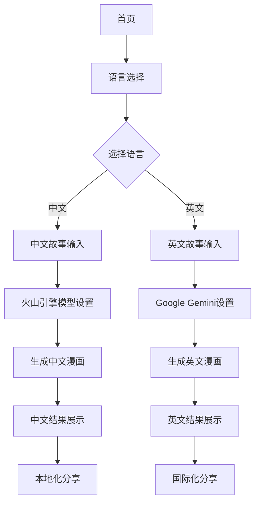

# Story to Manga 中文支持和火山引擎集成 - 产品需求文档

## 1. 产品概述

为现有的Story to Manga应用添加中文语言支持，实现英中双语切换功能，并集成火山引擎的Seedream4.0模型来为中文用户提供更优质的漫画生成体验。

该功能将使产品能够服务更广泛的中文用户群体，通过本地化的AI模型提供更符合中文语境和文化背景的漫画生成效果。

## 2. 核心功能

### 2.1 用户角色

| 角色 | 注册方式 | 核心权限 |
|------|----------|----------|
| 普通用户 | 无需注册，直接使用 | 可选择语言、生成漫画、下载作品 |
| 高级用户 | 未来扩展功能 | 更多模型选择、批量处理等 |

### 2.2 功能模块

我们的中文支持需求包含以下主要页面和功能：

1. **首页**：语言切换器、双语界面、本地化内容展示
2. **故事输入页面**：中文输入支持、字数统计（中文字符）、智能提示
3. **生成设置页面**：AI模型选择（Google Gemini vs 火山引擎）、风格选择
4. **结果展示页面**：中文字幕支持、本地化分享功能
5. **设置页面**：语言偏好设置、模型偏好配置

### 2.3 页面详情

| 页面名称 | 模块名称 | 功能描述 |
|----------|----------|----------|
| 首页 | 语言切换器 | 提供英文/中文切换按钮，记住用户选择 |
| 首页 | 本地化内容 | 根据语言显示对应的标题、描述、示例 |
| 故事输入页面 | 中文输入优化 | 支持中文输入法、字数统计、语法检查提示 |
| 故事输入页面 | 智能建议 | 基于中文语境提供故事结构建议 |
| 生成设置页面 | AI模型选择 | 英文内容使用Gemini，中文内容使用火山引擎Seedream4.0 |
| 生成设置页面 | 风格适配 | 为中文用户提供更符合国内审美的漫画风格选项 |
| 结果展示页面 | 中文字幕渲染 | 正确显示中文对话框和文字效果 |
| 结果展示页面 | 本地化分享 | 集成微信、微博等国内社交平台分享 |
| 设置页面 | 偏好管理 | 保存用户的语言和模型偏好设置 |

## 3. 核心流程

### 用户操作流程

**中文用户流程：**
1. 用户访问首页，选择中文语言
2. 进入故事输入页面，使用中文输入故事内容
3. 系统自动检测中文内容，推荐使用火山引擎模型
4. 用户确认设置，开始生成漫画
5. 系统调用火山引擎API生成中文漫画
6. 展示结果，支持中文字幕和本地化分享

**英文用户流程：**
1. 用户保持英文界面或主动切换
2. 使用现有的Google Gemini流程
3. 生成英文漫画内容

## 4. 用户界面设计

### 4.1 设计风格

- **主色调**：保持现有的蓝色主题（#3B82F6），辅助色为温暖的橙色（#F59E0B）
- **按钮样式**：圆角设计，支持中文字体的合适padding
- **字体**：英文使用Inter，中文使用思源黑体或苹方字体
- **字体大小**：中文界面适当增大字号（16px基础，18px标题）
- **布局风格**：响应式卡片布局，适配中文文本长度
- **图标风格**：使用国际化友好的图标，添加中文特色元素

### 4.2 页面设计概览

| 页面名称 | 模块名称 | UI元素 |
|----------|----------|--------|
| 首页 | 语言切换器 | 右上角下拉菜单，国旗图标+语言名称，平滑切换动画 |
| 首页 | 本地化横幅 | 中文标题使用较大字号，副标题说明火山引擎优势 |
| 故事输入页面 | 中文输入区 | 文本框支持中文输入法，实时字数统计，中文语法提示 |
| 设置页面 | 模型选择器 | 卡片式选择，显示模型特点和适用语言 |
| 结果页面 | 中文渲染 | 优化中文字体渲染，正确的行高和字间距 |

### 4.3 响应式设计

产品采用移动优先的响应式设计，特别优化中文在移动设备上的显示效果，考虑中文输入法的交互体验。

## 5. 技术要求

### 5.1 国际化框架
- 使用next-i18next或类似i18n解决方案
- 支持动态语言切换，无需页面刷新
- 翻译文件采用JSON格式，便于维护

### 5.2 AI模型集成
- 集成火山引擎Seedream4.0 API
- 实现智能模型路由（根据语言自动选择）
- 保持现有Google Gemini集成

### 5.3 性能优化
- 按需加载语言包
- 中文字体优化加载
- API响应缓存机制

### 5.4 用户体验
- 语言偏好本地存储
- 平滑的语言切换动画
- 中文输入法兼容性测试