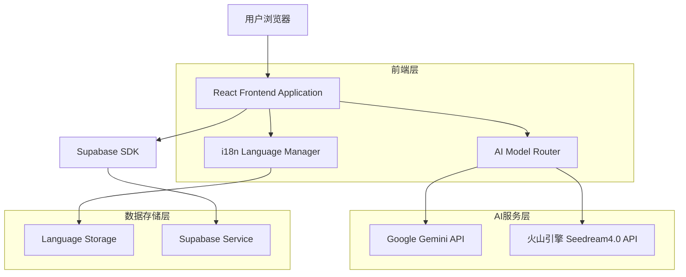
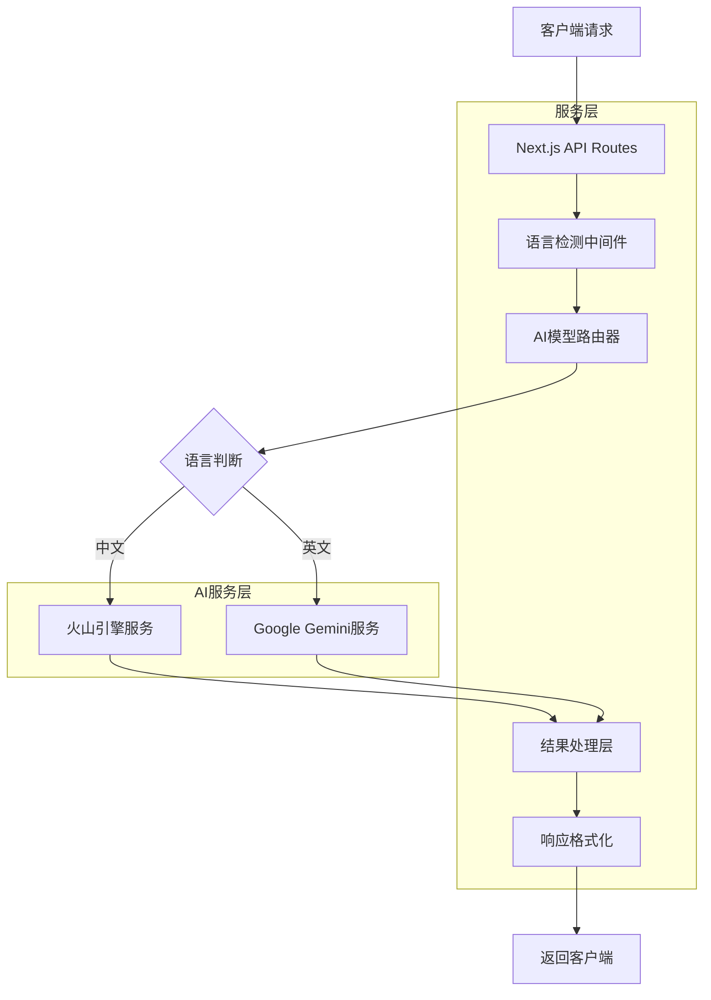
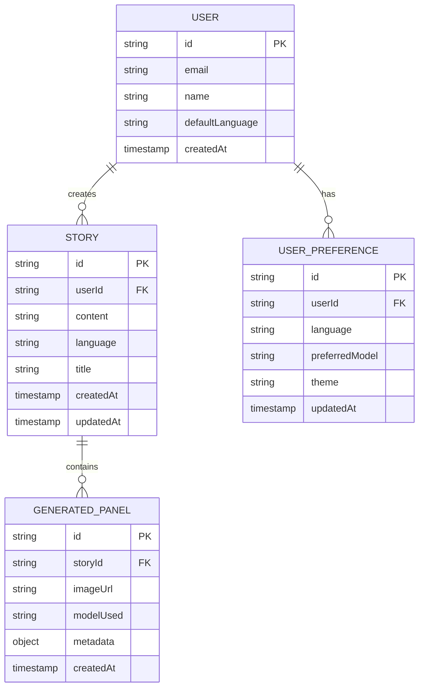

# Story to Manga 中文支持和火山引擎集成 - 技术架构文档

## 1. 架构设计



## 2. 技术描述

- **前端**: React@18 + Next.js@15 + TypeScript + Tailwind CSS + next-i18next@15
- **AI集成**: Google Gemini API + 火山引擎 Seedream4.0 API
- **状态管理**: React Context + localStorage
- **国际化**: next-i18next + react-i18next
- **字体支持**: @next/font + 思源黑体

## 3. 路由定义

| 路由 | 用途 |
|------|------|
| /[locale] | 国际化首页，支持 /en 和 /zh 路径 |
| /[locale]/create | 故事创建页面，根据语言显示对应界面 |
| /[locale]/gallery | 作品展示页面，本地化内容展示 |
| /[locale]/settings | 设置页面，语言和模型偏好配置 |

## 4. API定义

### 4.1 核心API

**AI模型路由API**
```
POST /api/generate-content
```

请求参数:
| 参数名称 | 参数类型 | 是否必需 | 描述 |
|----------|----------|----------|------|
| content | string | true | 故事内容 |
| language | string | true | 语言代码 (en/zh) |
| style | string | true | 漫画风格 |
| modelPreference | string | false | 用户模型偏好 |

响应参数:
| 参数名称 | 参数类型 | 描述 |
|----------|----------|------|
| success | boolean | 请求状态 |
| model | string | 使用的AI模型 |
| result | object | 生成结果 |

示例请求:
```json
{
  "content": "一个关于友谊的故事",
  "language": "zh",
  "style": "manga",
  "modelPreference": "auto"
}
```

**语言切换API**
```
POST /api/user/language
```

请求参数:
| 参数名称 | 参数类型 | 是否必需 | 描述 |
|----------|----------|----------|------|
| language | string | true | 目标语言 (en/zh) |
| userId | string | false | 用户ID（如果已登录） |

**火山引擎代理API**
```
POST /api/volcengine/generate
```

请求参数:
| 参数名称 | 参数类型 | 是否必需 | 描述 |
|----------|----------|----------|------|
| prompt | string | true | 中文提示词 |
| style | string | true | 生成风格 |
| parameters | object | false | 模型参数 |

## 5. 服务器架构图



## 6. 数据模型

### 6.1 数据模型定义



### 6.2 数据定义语言

**用户偏好表 (user_preferences)**
```sql
-- 创建表
CREATE TABLE user_preferences (
    id UUID PRIMARY KEY DEFAULT gen_random_uuid(),
    user_id UUID REFERENCES users(id),
    language VARCHAR(10) DEFAULT 'en' CHECK (language IN ('en', 'zh')),
    preferred_model VARCHAR(50) DEFAULT 'auto' CHECK (preferred_model IN ('auto', 'gemini', 'volcengine')),
    theme VARCHAR(20) DEFAULT 'light',
    created_at TIMESTAMP WITH TIME ZONE DEFAULT NOW(),
    updated_at TIMESTAMP WITH TIME ZONE DEFAULT NOW()
);

-- 创建索引
CREATE INDEX idx_user_preferences_user_id ON user_preferences(user_id);
CREATE INDEX idx_user_preferences_language ON user_preferences(language);

-- 初始化数据
INSERT INTO user_preferences (user_id, language, preferred_model) 
VALUES 
('00000000-0000-0000-0000-000000000001', 'zh', 'volcengine'),
('00000000-0000-0000-0000-000000000002', 'en', 'gemini');
```

**故事表扩展 (stories)**
```sql
-- 修改现有表，添加语言支持
ALTER TABLE stories ADD COLUMN language VARCHAR(10) DEFAULT 'en';
ALTER TABLE stories ADD COLUMN model_used VARCHAR(50);
ALTER TABLE stories ADD COLUMN generation_metadata JSONB;

-- 创建索引
CREATE INDEX idx_stories_language ON stories(language);
CREATE INDEX idx_stories_model_used ON stories(model_used);

-- 权限设置
GRANT SELECT ON user_preferences TO anon;
GRANT ALL PRIVILEGES ON user_preferences TO authenticated;
GRANT SELECT ON stories TO anon;
GRANT ALL PRIVILEGES ON stories TO authenticated;
```

## 7. 实现计划

### 7.1 第一阶段：基础国际化
- 安装和配置 next-i18next
- 创建中英文翻译文件
- 实现语言切换组件
- 适配现有页面的多语言显示

### 7.2 第二阶段：火山引擎集成
- 注册火山引擎账号，获取API密钥
- 创建火山引擎API客户端
- 实现AI模型路由逻辑
- 测试中文内容生成效果

### 7.3 第三阶段：用户体验优化
- 实现语言偏好存储
- 优化中文字体加载
- 添加中文输入优化
- 性能测试和优化

### 7.4 第四阶段：高级功能
- 智能模型推荐
- 批量处理支持
- 本地化分享功能
- 用户反馈收集

## 8. 环境变量配置

```bash
# 现有配置
GOOGLE_AI_API_KEY=your_google_ai_api_key
NEXT_PUBLIC_GA_MEASUREMENT_ID=your_ga_id

# 新增配置
# 火山引擎配置
VOLCENGINE_API_KEY=your_volcengine_api_key
VOLCENGINE_SECRET_KEY=your_volcengine_secret_key
VOLCENGINE_REGION=cn-beijing

# 国际化配置
NEXT_PUBLIC_DEFAULT_LOCALE=en
NEXT_PUBLIC_SUPPORTED_LOCALES=en,zh

# 功能开关
NEXT_PUBLIC_ENABLE_VOLCENGINE=true
NEXT_PUBLIC_ENABLE_AUTO_MODEL_SELECTION=true
```

## 9. 部署考虑

### 9.1 CDN配置
- 为中文字体文件配置CDN加速
- 静态资源本地化部署
- API响应缓存策略

### 9.2 监控和日志
- 添加多语言使用情况统计
- AI模型调用成功率监控
- 用户语言偏好分析

### 9.3 安全考虑
- API密钥安全存储
- 跨域请求配置
- 内容安全策略更新