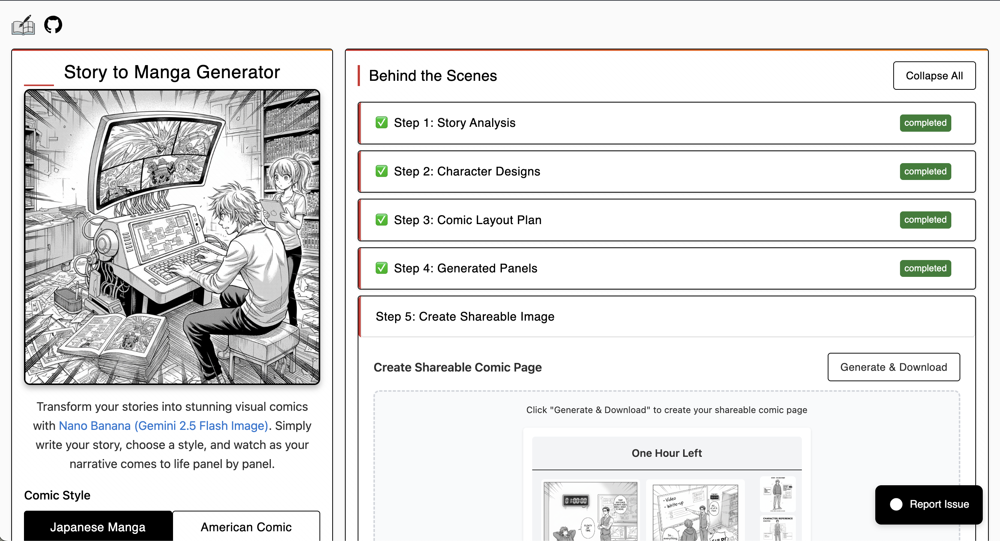
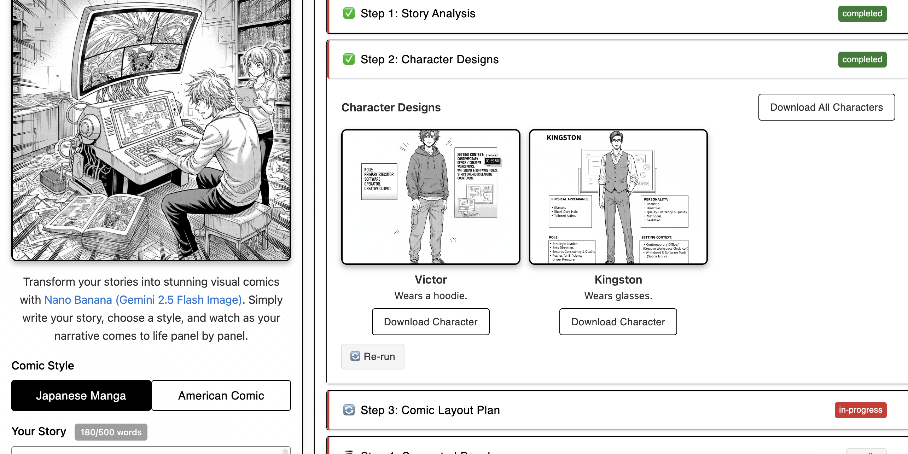
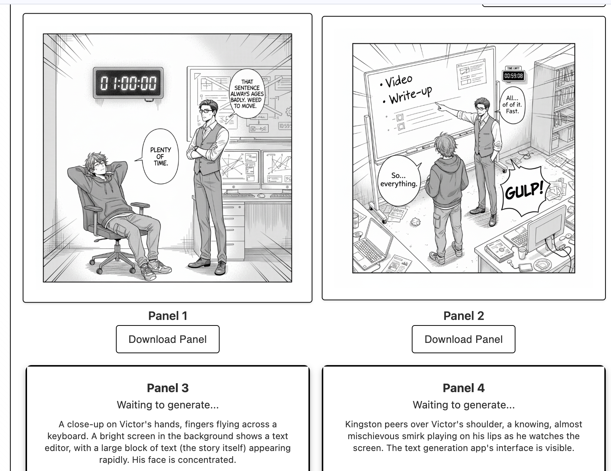

# Story to Manga Machine Enhanced 🎨

**The Ultimate AI-Powered Story-to-Visual Converter**

Transform your written stories into stunning visual manga or comic book pages using multiple AI models including Google's Gemini 2.5 Flash and VolcEngine Doubao!

> **🚀 This is an enhanced version** based on the original [Story to Manga Machine](https://github.com/victorhuangwq/story-to-manga) by victorhuangwq, featuring significant improvements and new capabilities.

## ✨ What's New in Enhanced Version

- 🤖 **Multi-AI Model Support**: Choose between Google Gemini and VolcEngine Doubao
- 📁 **Project Management**: Create, save, and manage multiple story projects
- 🎨 **6 Comic Styles**: Japanese Manga, American Comic, Chinese Wuxia, Healing, Korean Manhwa, Cinematic
- 🖼️ **Advanced Image Editing**: Redraw and modify panels with reference images
- 📏 **Custom Image Sizes**: Configure image dimensions per project
- 🌍 **Internationalization**: Full Chinese and English language support
- 📄 **Pagination System**: Handle large projects with 50+ panels
- ⚡ **Performance Optimizations**: Caching, parallel processing, lazy loading
- 🔄 **Continue Generation**: Resume interrupted generations seamlessly
- 📱 **Enhanced UI/UX**: Modern design with improved user experience

## Screenshots

<table>
  <tr>
    <td align="center" width="50%">
      
      <br><sub><b>Main Interface</b></sub>
    </td>
    <td align="center" width="50%">
      
      <br><sub><b>Character Design</b></sub>
    </td>
  </tr>
  <tr>
    <td align="center" width="50%">
      
      <br><sub><b>Generation Progress</b></sub>
    </td>
    <td align="center" width="50%">
      
      <br><sub><b>Final Output</b></sub>
    </td>
  </tr>
</table>

## 🌟 Core Features

### 🤖 Multi-AI Model Support
- **Google Gemini 2.5 Flash**: High-quality image generation with excellent character consistency
- **VolcEngine Doubao**: Alternative AI model for diverse artistic styles
- **Automatic Model Selection**: Smart fallback system for optimal results

### 🎨 Six Distinct Comic Styles
- **Japanese Manga**: Traditional manga aesthetics with detailed linework
- **American Comic**: Bold superhero comic book style
- **Chinese Wuxia**: Martial arts and cultivation themes with Eastern aesthetics
- **Healing Style**: Soft, warm, therapeutic visual style
- **Korean Manhwa**: Modern webtoon-inspired artistic approach
- **Cinematic**: Movie-like dramatic and realistic rendering

### 📁 Advanced Project Management
- **Multiple Projects**: Create and manage separate story projects
- **Auto-Save**: Never lose your work with automatic state persistence
- **Project Switching**: Seamlessly switch between different stories
- **Generation History**: Track and resume interrupted generations

### 🖼️ Professional Image Editing
- **Panel Redrawing**: Regenerate individual panels with new prompts
- **Reference Images**: Upload custom reference images or use character designs
- **Image Modification**: Advanced editing with AI-powered modifications
- **Custom Sizing**: Configure image dimensions per project (1K, 2K, 4K options)

### ⚡ Performance & Scalability
- **Parallel Processing**: Generate multiple panels simultaneously
- **Smart Caching**: Intelligent caching system for faster regeneration
- **Lazy Loading**: Handle large projects (50+ panels) efficiently
- **Pagination**: Organized display with auto-download for all pages

### 🌍 International Support
- **Bilingual Interface**: Full Chinese and English language support
- **Localized Content**: Culturally appropriate prompts and styles
- **Regional AI Models**: Optimized for different markets and preferences

## 🛠️ Tech Stack

### Frontend
- **Next.js 15**: Latest React framework with App Router
- **TypeScript**: Full type safety and developer experience
- **Tailwind CSS v4**: Modern utility-first CSS framework
- **React i18next**: Internationalization and localization

### AI Models & APIs
- **Google Gemini 2.5 Flash**: Primary AI model for image generation
- **VolcEngine Doubao**: Secondary AI model with unique capabilities
- **Smart Model Router**: Automatic model selection and fallback

### Storage & Performance
- **Hybrid Storage**: localStorage (text) + IndexedDB (images)
- **Advanced Caching**: LRU cache with automatic cleanup
- **Image Optimization**: Client-side compression and format conversion
- **Parallel Processing**: Concurrent API requests for faster generation

### Image Processing
- **HTML2Canvas**: Social media composite generation
- **Custom Image Proxy**: Secure image handling and caching
- **Multi-format Support**: JPEG, PNG, WebP optimization

### Development & Deployment
- **Biome**: Fast linting and formatting
- **TypeScript**: Strict type checking
- **Knip**: Dead code elimination
- **AWS Amplify**: Production deployment

## 🚀 Quick Start

### Prerequisites
- Node.js 18+
- pnpm (recommended) or npm

### 1. Clone Repository

```bash
git clone https://github.com/yourusername/story-to-manga-enhanced.git
cd story-to-manga-enhanced
```

### 2. Install Dependencies

```bash
pnpm install
```

### 3. Configure API Keys

Copy the environment template:
```bash
cp .env.local.example .env.local
```

Edit `.env.local` and add your API keys:

```env
# Google AI API Key (Primary)
GOOGLE_AI_API_KEY=your_google_ai_api_key_here

# VolcEngine API Key (Optional, for additional AI model)
VOLCENGINE_API_KEY=your_volcengine_api_key_here

# Development settings
NODE_ENV=development
```

#### Getting API Keys:

**Google AI API Key:**
1. Visit [Google AI Studio](https://aistudio.google.com/app/apikey)
2. Sign in with your Google account
3. Create a new API key
4. Copy the API key

**VolcEngine API Key (Optional):**
1. Visit [VolcEngine Console](https://console.volcengine.com/)
2. Create an account and verify
3. Navigate to AI Services → Image Generation
4. Create API credentials

### 4. Run Development Server

```bash
pnpm dev
```

Open [http://localhost:8000](http://localhost:8000) in your browser.

## 🔄 How It Works

### 1. **Project Creation & Setup**
- Create a new project with custom settings
- Choose from 6 distinct comic styles
- Configure image dimensions and language preferences

### 2. **Intelligent Story Analysis**
- AI analyzes your narrative structure and themes
- Extracts characters, settings, and emotional arcs
- Identifies key scenes and dialogue moments

### 3. **Character Design Generation**
- Creates consistent character reference sheets
- Generates detailed visual descriptions
- Maintains character consistency across all panels

### 4. **Smart Panel Planning**
- Intelligently breaks story into sequential panels (up to 50)
- Optimizes scene descriptions and dialogue placement
- Plans visual composition and pacing

### 5. **Multi-Model Panel Generation**
- Generates panels using selected AI model
- Maintains character consistency with reference sheets
- Supports parallel processing for faster generation

### 6. **Advanced Editing & Export**
- Edit individual panels with redraw functionality
- Add custom reference images for better results
- Export individual panels or create paginated composites

## 📖 Usage Guide

### Basic Workflow

1. **Create New Project**: Click "我的项目" → "新建项目"
2. **Configure Settings**:
   - Choose comic style (Manga, Comic, Wuxia, etc.)
   - Set image dimensions (1K, 2K, 4K)
   - Select language preference
3. **Input Your Story**: Paste your story (up to 2000 words)
4. **Generate Content**: Click "生成漫画" and watch the magic happen:
   - Story analysis and character extraction
   - Character reference sheet generation
   - Panel-by-panel comic creation
5. **Edit & Refine**: Use editing tools to perfect your panels
6. **Export & Share**: Download individual panels or complete pages

### Advanced Features

- **Project Management**: Switch between multiple story projects
- **Continue Generation**: Resume interrupted generations seamlessly
- **Batch Operations**: Generate multiple panels simultaneously
- **Reference Images**: Upload custom images to guide AI generation
- **Multi-language**: Switch between Chinese and English interfaces

## 🚀 Deployment

### AWS Amplify (Recommended)

1. Fork this repository to your GitHub account
2. Connect your GitHub repo to AWS Amplify
3. Add environment variables in Amplify console:
   ```
   GOOGLE_AI_API_KEY=your_google_ai_api_key
   VOLCENGINE_API_KEY=your_volcengine_api_key (optional)
   ```
4. Deploy automatically on push

### Vercel

1. Fork this repository
2. Import project to Vercel
3. Add environment variables in Vercel dashboard
4. Deploy with one click

### Docker (Coming Soon)

Docker support will be added in future releases for easy self-hosting.

## 📝 Story Guidelines

### ✅ Best Practices for Optimal Results

**Story Length:**
- **Optimal**: 500-2000 words
- **Minimum**: 200 words for meaningful content
- **Maximum**: 2000 words (longer stories will be chunked)

**Content Structure:**
- Clear character introductions and descriptions
- Well-defined settings and environments
- Dialogue-heavy scenes work exceptionally well
- Action sequences with clear visual elements
- Emotional moments and character interactions

**Character Guidelines:**
- Provide physical descriptions (appearance, clothing, distinctive features)
- Limit to 3-5 main characters for best consistency
- Include personality traits that affect visual presentation

### ❌ What to Avoid

- Extremely complex plots with numerous characters
- Stories requiring specific copyrighted visual references
- Adult content or inappropriate material
- Overly abstract or philosophical content without visual elements
- Stories with rapid location changes

## 🐛 Troubleshooting

### Common Issues

**"Failed to generate character references"**
- Verify API keys are correctly configured
- Check if you've exceeded rate limits (wait 1-2 minutes)
- Ensure stable internet connection
- Try switching AI models in settings

**"Generation stopped unexpectedly"**
- Use "Continue Generation" feature to resume
- Check browser console for specific error messages
- Verify sufficient browser storage space

**"Images not displaying"**
- Clear browser cache and cookies
- Disable ad blockers temporarily
- Check network connectivity
- Try refreshing the page

**"Project not saving"**
- Ensure browser allows localStorage and IndexedDB
- Check available storage space
- Try creating a new project

### Performance Tips

- Close unnecessary browser tabs during generation
- Use Chrome or Firefox for best performance
- Ensure stable internet connection
- Generate during off-peak hours for faster API responses

## 🤝 Contributing

We welcome contributions! Here's how you can help:

### Ways to Contribute

- 🐛 **Bug Reports**: Submit detailed issue reports
- 💡 **Feature Requests**: Suggest new features or improvements
- 🔧 **Code Contributions**: Submit pull requests
- 📖 **Documentation**: Improve documentation and guides
- 🌍 **Translations**: Add support for more languages
- 🎨 **UI/UX**: Suggest design improvements

### Development Setup

1. Fork the repository
2. Create a feature branch: `git checkout -b feature/amazing-feature`
3. Make your changes and test thoroughly
4. Commit with clear messages: `git commit -m 'Add amazing feature'`
5. Push to your branch: `git push origin feature/amazing-feature`
6. Open a Pull Request

## 📄 License

MIT License - This project is open source and free to use for personal and commercial projects.

## 🙏 Acknowledgments

This enhanced version is built upon the excellent foundation of the original [Story to Manga Machine](https://github.com/victorhuangwq/story-to-manga) by victorhuangwq. We extend our gratitude for the initial concept and implementation.

### Key Enhancements Added:
- Multi-AI model support and intelligent routing
- Comprehensive project management system
- Advanced image editing and modification tools
- Six distinct comic styles with cultural authenticity
- Full internationalization and localization
- Performance optimizations and scalability improvements
- Modern UI/UX with enhanced user experience

---

**Made with ❤️ for the global storytelling community**
