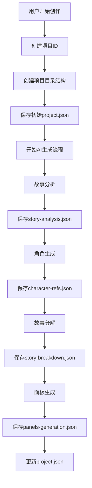
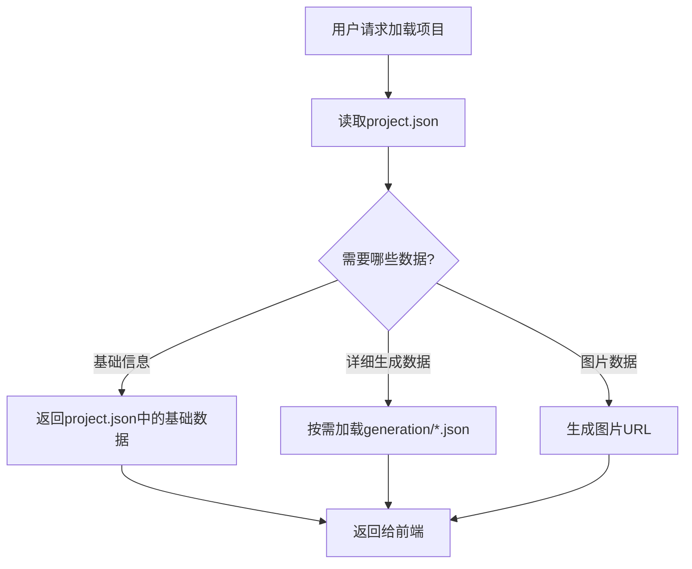

# 云端存储架构设计文档

## 🎯 **设计目标**

1. **清晰的目录结构** - 按照 `用户/项目/数据` 的层次组织
2. **避免数据重复** - 公开分享时不重复保存数据
3. **完整的JSON保存** - 所有AI生成的结果都要保存
4. **高效的数据加载** - 支持按需加载和缓存
5. **灵活的分享机制** - 支持私有和公开访问

## 📁 **目录结构设计**

### 当前问题分析
```
❌ 当前混乱的结构：
mangashare/
├── users/{userId}/projects/{projectId}/...
├── anonymous/{deviceId}/projects/{projectId}/...
├── {userId}/projects/{projectId}/panels/...  # 路径不一致
├── public/comics/{comicId}/...               # 重复数据
└── temp/{userId}/...                         # 临时文件混乱
```

### 新的统一结构
```
✅ 新的清晰结构：
mangashare/
├── private/                                  # 私有数据区域
│   ├── users/                               # 注册用户数据
│   │   └── {userId}/
│   │       └── projects/
│   │           └── {projectId}/
│   │               ├── project.json         # 项目完整数据
│   │               ├── generation/          # AI生成过程数据
│   │               │   ├── story-analysis.json
│   │               │   ├── character-refs.json
│   │               │   ├── story-breakdown.json
│   │               │   └── panels-generation.json
│   │               ├── images/              # 图片文件
│   │               │   ├── characters/      # 角色图片
│   │               │   │   ├── generated/   # AI生成的角色图
│   │               │   │   │   └── {characterName}.jpg
│   │               │   │   └── uploaded/    # 用户上传的角色参考
│   │               │   │       └── {refId}.jpg
│   │               │   ├── settings/        # 场景图片
│   │               │   │   └── uploaded/
│   │               │   │       └── {refId}.jpg
│   │               │   └── panels/          # 面板图片
│   │               │       └── {panelNumber}.jpg
│   │               └── metadata.json        # 项目元数据
│   └── anonymous/                           # 匿名用户数据
│       └── {deviceId}/
│           └── projects/
│               └── {projectId}/
│                   └── [同上结构]
├── public/                                  # 公开数据区域
│   ├── comics/                             # 公开发布的漫画
│   │   └── {comicId}/
│   │       ├── comic.json                  # 公开漫画数据（引用私有数据）
│   │       └── thumbnail.jpg               # 缩略图
│   └── shared/                             # 临时分享链接
│       └── {shareId}/
│           └── share.json                  # 分享数据（引用私有数据）
└── temp/                                   # 临时文件
    └── {sessionId}/
        └── {timestamp}/
            └── [临时文件]
```

## 📊 **数据结构设计**

### 1. 项目完整数据 (`project.json`)
```json
{
  "version": "3.0.0",
  "projectId": "项目ID",
  "metadata": {
    "name": "项目名称",
    "description": "项目描述",
    "createdAt": "2024-01-01T00:00:00Z",
    "updatedAt": "2024-01-01T00:00:00Z",
    "userId": "用户ID",
    "isPublic": false,
    "tags": ["标签1", "标签2"]
  },
  "input": {
    "story": "原始故事文本",
    "style": "漫画风格",
    "language": "语言",
    "aiModel": "AI模型",
    "imageSize": {
      "width": 1024,
      "height": 576,
      "aspectRatio": "16:9"
    }
  },
  "generation": {
    "storyAnalysis": {
      "dataPath": "generation/story-analysis.json",
      "completedAt": "2024-01-01T00:00:00Z"
    },
    "characterReferences": {
      "dataPath": "generation/character-refs.json",
      "completedAt": "2024-01-01T00:00:00Z"
    },
    "storyBreakdown": {
      "dataPath": "generation/story-breakdown.json",
      "completedAt": "2024-01-01T00:00:00Z"
    },
    "panelsGeneration": {
      "dataPath": "generation/panels-generation.json",
      "completedAt": "2024-01-01T00:00:00Z"
    }
  },
  "userUploads": {
    "characterReferences": [
      {
        "id": "ref-1",
        "name": "角色名称",
        "imagePath": "images/characters/uploaded/ref-1.jpg"
      }
    ],
    "settingReferences": [
      {
        "id": "setting-1",
        "name": "场景名称",
        "imagePath": "images/settings/uploaded/setting-1.jpg"
      }
    ]
  },
  "generationState": {
    "isGenerating": false,
    "currentStep": "completed",
    "progress": 100,
    "failedPanels": [],
    "retryCount": 0
  }
}
```

### 2. AI生成过程数据

#### 故事分析 (`generation/story-analysis.json`)
```json
{
  "timestamp": "2024-01-01T00:00:00Z",
  "input": {
    "story": "原始故事",
    "style": "healing",
    "language": "zh"
  },
  "output": {
    "title": "故事标题",
    "characters": [...],
    "setting": {...},
    "scenes": [...]
  },
  "metadata": {
    "model": "gemini-2.5-flash",
    "duration": 5.2,
    "retryCount": 0
  }
}
```

#### 角色生成 (`generation/character-refs.json`)
```json
{
  "timestamp": "2024-01-01T00:00:00Z",
  "input": {
    "characters": [...],
    "setting": {...},
    "style": "healing"
  },
  "output": {
    "characterReferences": [
      {
        "name": "角色名称",
        "description": "角色描述",
        "imagePath": "images/characters/generated/角色名称.jpg"
      }
    ]
  },
  "metadata": {
    "model": "volcengine",
    "duration": 15.8,
    "retryCount": 1
  }
}
```

#### 故事分解 (`generation/story-breakdown.json`)
```json
{
  "timestamp": "2024-01-01T00:00:00Z",
  "input": {
    "story": "原始故事",
    "characters": [...],
    "scenes": [...]
  },
  "output": {
    "panels": [
      {
        "panelNumber": 1,
        "characters": ["角色1"],
        "sceneId": "scene_1",
        "description": "面板描述",
        "dialogue": "对话内容",
        "cameraAngle": "镜头角度",
        "visualMood": "视觉氛围"
      }
    ]
  },
  "metadata": {
    "model": "gemini-2.5-flash",
    "duration": 8.3,
    "retryCount": 0
  }
}
```

#### 面板生成 (`generation/panels-generation.json`)
```json
{
  "timestamp": "2024-01-01T00:00:00Z",
  "input": {
    "panels": [...],
    "characterReferences": [...],
    "style": "healing"
  },
  "output": {
    "generatedPanels": [
      {
        "panelNumber": 1,
        "imagePath": "images/panels/1.jpg",
        "description": "面板描述",
        "characters": ["角色1"],
        "setting": "场景",
        "mood": "氛围",
        "modelUsed": "volcengine"
      }
    ]
  },
  "metadata": {
    "totalPanels": 5,
    "completedPanels": 5,
    "failedPanels": [],
    "totalDuration": 45.6,
    "averageDuration": 9.1
  }
}
```

### 3. 公开漫画数据 (`public/comics/{comicId}/comic.json`)
```json
{
  "version": "1.0.0",
  "comicId": "漫画ID",
  "title": "漫画标题",
  "description": "漫画描述",
  "author": {
    "id": "作者ID",
    "name": "作者名称",
    "avatar": "头像URL"
  },
  "style": "healing",
  "tags": ["标签1", "标签2"],
  "publishedAt": "2024-01-01T00:00:00Z",
  "sourceProject": {
    "userId": "原始用户ID",
    "projectId": "原始项目ID",
    "projectPath": "private/users/{userId}/projects/{projectId}"
  },
  "panels": [
    {
      "panelNumber": 1,
      "imageUrl": "https://domain.com/private/users/{userId}/projects/{projectId}/images/panels/1.jpg",
      "textContent": "面板文本内容"
    }
  ],
  "stats": {
    "views": 0,
    "likes": 0,
    "shares": 0
  }
}
```

## 🔄 **数据流程设计**

### 1. 项目创建和生成流程


### 2. 数据加载流程


### 3. 公开分享流程
```mermaid
graph TD
    A[用户点击分享] --> B[检查项目完整性]
    B --> C[创建comicId]
    C --> D[创建public/comics/{comicId}/目录]
    D --> E[生成comic.json引用私有数据]
    E --> F[生成缩略图]
    F --> G[保存到Supabase数据库]
    G --> H[返回分享链接]
```

## 🛠 **实现计划**

### Phase 1: 目录结构重构
1. 创建新的路径生成函数
2. 更新所有API的文件路径逻辑
3. 实现数据迁移脚本

### Phase 2: JSON数据分离
1. 拆分project.json为多个文件
2. 实现按需加载逻辑
3. 更新保存和加载API

### Phase 3: 分享机制优化
1. 实现引用式分享（不重复数据）
2. 优化公开URL生成
3. 添加分享权限控制

### Phase 4: 性能优化
1. 实现数据缓存机制
2. 添加CDN支持
3. 优化图片加载策略

## 📈 **预期收益**

1. **存储空间节省** - 避免数据重复，节省50%以上存储空间
2. **加载性能提升** - 按需加载，减少不必要的数据传输
3. **维护性改善** - 清晰的目录结构，便于调试和维护
4. **扩展性增强** - 支持更复杂的数据结构和功能
5. **用户体验优化** - 更快的加载速度和更稳定的分享功能
